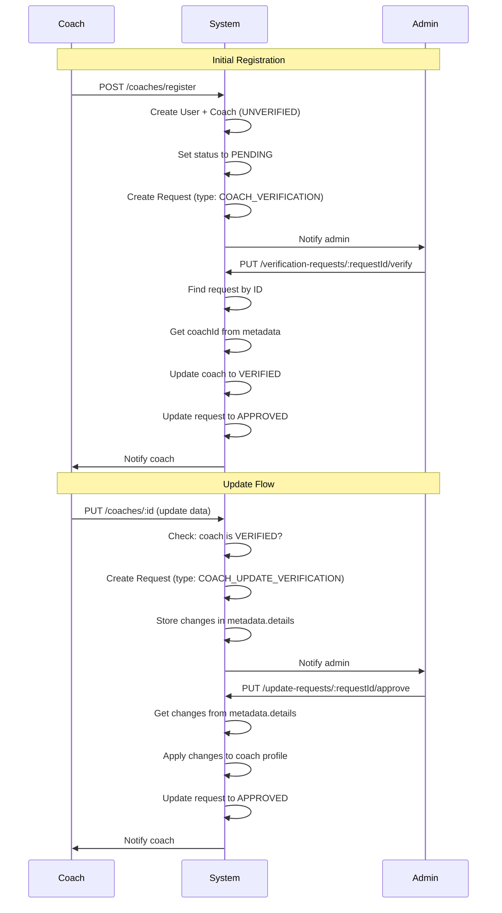

# Coach Profile Update Flow - AI Implementation Guide

## Overview
This document provides clear instructions for AI agents to understand and implement the coach profile update verification system. The system uses a request-based approval workflow where verified coaches cannot directly update their profiles; instead, they create update requests that admins must approve.

## Core Concepts

### 1. Coach Verification Status
```typescript
enum CoachVerificationStatus {
  UNVERIFIED = 'UNVERIFIED',  // Initial state after registration
  PENDING = 'PENDING',         // Waiting for admin verification
  VERIFIED = 'VERIFIED',       // Approved by admin
  REJECTED = 'REJECTED'        // Rejected by admin
}
```

### 2. Request Types
```typescript
enum RequestType {
  COACH_VERIFICATION = 'COACH_VERIFICATION',              // Initial registration verification
  COACH_UPDATE_VERIFICATION = 'COACH_UPDATE_VERIFICATION' // Profile update verification
}

enum RequestStatus {
  PENDING = 'PENDING',
  APPROVED = 'APPROVED',
  REJECTED = 'REJECTED'
}
```

## Database Schema

### Coach Entity
```typescript
@Entity('coaches')
export class Coach {
  @PrimaryGeneratedColumn()
  id: number;

  @Column({ type: 'text' })
  bio: string;

  @Column({ type: 'text', nullable: true })
  specialties: string[];

  @Column({ name: 'teaching_methods', type: 'text', nullable: true })
  teachingMethods: string[];

  @Column({ name: 'year_of_experience', type: 'int' })
  yearOfExperience: number;

  @Column({
    name: 'verification_status',
    type: 'enum',
    enum: CoachVerificationStatus,
    default: CoachVerificationStatus.UNVERIFIED,
  })
  verificationStatus: CoachVerificationStatus;

  @ManyToOne(() => User, (user) => user.coach)
  user: User;

  @OneToMany(() => Credential, (credential) => credential.coach)
  credentials: Credential[];
}
```

### Request Entity
```typescript
@Entity('requests')
export class Request {
  @PrimaryGeneratedColumn()
  id: number;

  @Column({ type: 'text' })
  description: string;

  @Column({ type: 'enum', enum: RequestType })
  type: RequestType;

  @Column({ type: 'enum', enum: RequestStatus })
  status: RequestStatus;

  @Column({ type: 'jsonb', nullable: true })
  metadata: RequestMetadata; // Stores coach data and pending changes

  @ManyToOne(() => User)
  createdBy: User;

  @OneToMany(() => RequestAction, (action) => action.request)
  actions: RequestAction[];
}
```

## Workflow Implementation

### Flow 1: Initial Coach Registration
**File**: `apps/api-gateway/src/services/coach.service.ts` → `registerCoach()`

```typescript
async registerCoach(data: RegisterCoachDto): Promise<CustomApiResponse<void>> {
  // 1. Validate user doesn't already exist
  // 2. Hash password
  // 3. Create User with nested Coach entity
  // 4. Create verification request
  const verificationRequest = {
    description: `Yêu cầu xác minh huấn luyện viên: ${savedUser.fullName}`,
    type: RequestType.COACH_VERIFICATION,
    status: RequestStatus.PENDING,
    metadata: {
      type: 'coach',
      id: coach.id,
      details: {
        bio: coach.bio,
        specialties: coach.specialties,
        teachingMethods: coach.teachingMethods,
        yearOfExperience: coach.yearOfExperience,
        credentials: coach.credentials
      }
    },
    createdBy: savedUser
  };
  // 5. Set coach status to PENDING
  // 6. Notify admins
  // 7. Return success message
}
```

**Key Points**:
- Coach starts with `UNVERIFIED` status
- Immediately updated to `PENDING` after creating request
- Metadata stores snapshot of submitted data
- Admin notification sent with request ID

### Flow 2: Admin Verifies Coach (Request-Based)
**Endpoint**: `PUT /coaches/verification-requests/:requestId/verify`
**File**: `apps/api-gateway/src/services/coach.service.ts` → `verifyCoach()`

```typescript
async verifyCoach(requestId: number, comment?: string): Promise<CustomApiResponse<void>> {
  // 1. Find verification request by requestId (NOT coachId)
  const verificationRequest = await findOne({
    where: {
      id: requestId,
      type: RequestType.COACH_VERIFICATION
    }
  });

  // 2. Validate request exists and is PENDING
  if (!verificationRequest || verificationRequest.status !== RequestStatus.PENDING) {
    throw new BadRequestException('Request not found or already processed');
  }

  // 3. Get coach ID from request metadata
  const coachId = verificationRequest.metadata['id'];
  const coach = await findCoach(coachId);

  // 4. Validate coach is in PENDING status
  if (coach.verificationStatus !== CoachVerificationStatus.PENDING) {
    throw new BadRequestException('Only PENDING coaches can be verified');
  }

  // 5. Update coach status to VERIFIED
  await updateCoach(coach.id, { verificationStatus: CoachVerificationStatus.VERIFIED });

  // 6. Update request status to APPROVED
  await updateRequest(verificationRequest.id, { status: RequestStatus.APPROVED });

  // 7. Create request action for audit trail
  await createRequestAction({
    type: RequestActionType.APPROVED,
    comment: comment || 'Xác minh thành công',
    handledBy: currentAdmin,
    request: verificationRequest
  });

  // 8. Activate user account if not active
  if (!coach.user.isActive) {
    await updateUser(coach.user.id, { isActive: true });
  }

  // 9. Notify coach of approval
  await sendNotification(coach.user.id, 'Verification approved');
}
```

### Flow 3: Admin Rejects Coach (Request-Based)
**Endpoint**: `PUT /coaches/verification-requests/:requestId/reject`
**File**: `apps/api-gateway/src/services/coach.service.ts` → `rejectCoach()`

```typescript
async rejectCoach(requestId: number, reason: string): Promise<CustomApiResponse<void>> {
  // 1. Find verification request by requestId
  const verificationRequest = await findOne({
    where: {
      id: requestId,
      type: RequestType.COACH_VERIFICATION
    }
  });

  // 2. Validate request and reason
  if (!reason) throw new BadRequestException('Reason is required');
  if (!verificationRequest || verificationRequest.status !== RequestStatus.PENDING) {
    throw new BadRequestException('Request not found or already processed');
  }

  // 3. Get coach from metadata and update to REJECTED
  const coachId = verificationRequest.metadata['id'];
  await updateCoach(coachId, { verificationStatus: CoachVerificationStatus.REJECTED });

  // 4. Update request status to REJECTED
  await updateRequest(verificationRequest.id, { status: RequestStatus.REJECTED });

  // 5. Create request action with rejection reason
  await createRequestAction({
    type: RequestActionType.REJECTED,
    comment: reason,
    handledBy: currentAdmin,
    request: verificationRequest
  });

  // 6. Notify coach with detailed reason
  await sendNotification(coach.user.id, `Rejected: ${reason}. You can update and resubmit.`);
}
```

### Flow 4: Verified Coach Updates Profile
**Endpoint**: `PUT /coaches/:id`
**File**: `apps/api-gateway/src/services/coach.service.ts` → `update()`

```typescript
async update(data: UpdateCoachProfileDto): Promise<CustomApiResponse<void>> {
  // 1. Find coach by authenticated user
  const coach = await findOne({
    where: { user: { id: currentUser.id } }
  });

  // 2. Check current verification status
  if (coach.verificationStatus === CoachVerificationStatus.PENDING) {
    throw new BadRequestException('Cannot update while verification is pending');
  }

  // 3. VERIFIED coaches: Create update request (DO NOT update directly)
  if (coach.verificationStatus === CoachVerificationStatus.VERIFIED) {
    // Check for existing pending update request
    const existingUpdateRequest = await findOne({
      where: {
        type: RequestType.COACH_UPDATE_VERIFICATION,
        status: RequestStatus.PENDING,
        metadata: { id: coach.id }
      }
    });

    if (existingUpdateRequest) {
      throw new BadRequestException('Update request already pending. Wait for admin approval.');
    }

    // Create new update request with changes in metadata
    const updateRequest = {
      description: `Yêu cầu cập nhật hồ sơ: ${coach.user.fullName}`,
      type: RequestType.COACH_UPDATE_VERIFICATION,
      status: RequestStatus.PENDING,
      metadata: {
        type: 'coach-update',
        id: coach.id,
        details: data // Store ALL update data here
      },
      createdBy: coach.user
    };

    await saveRequest(updateRequest);
    await notifyAdmins('Coach update request submitted');
    return 'Update request submitted. Waiting for admin approval.';
  }

  // 4. REJECTED/UNVERIFIED coaches: Allow direct update
  const updateData = { ...data };
  
  // Handle credentials separately if needed
  if (data.credentials) {
    updateData.credentials = coach.credentials.map(cred => {
      const update = data.credentials.find(c => c.id === cred.id);
      return update ? { ...cred, ...update } : cred;
    });
  }

  await updateCoach(coach.id, updateData);

  // 5. If REJECTED, create new verification request after update
  if (coach.verificationStatus === CoachVerificationStatus.REJECTED) {
    const updatedCoach = await findCoach(coach.id);
    
    const verificationRequest = {
      description: `Yêu cầu xác minh lại: ${updatedCoach.user.fullName}`,
      type: RequestType.COACH_VERIFICATION,
      status: RequestStatus.PENDING,
      metadata: {
        type: 'coach',
        id: updatedCoach.id,
        details: { /* current coach data */ }
      },
      createdBy: updatedCoach.user
    };

    await saveRequest(verificationRequest);
    await updateCoach(coach.id, { verificationStatus: CoachVerificationStatus.PENDING });
    await notifyAdmins('Coach resubmitted for verification');
    return 'Profile updated and resubmitted for verification.';
  }

  return 'Profile updated successfully.';
}
```

### Flow 5: Admin Approves Update Request
**Endpoint**: `PUT /coaches/update-requests/:requestId/approve`
**File**: `apps/api-gateway/src/services/coach.service.ts` → `approveCoachUpdate()`

```typescript
async approveCoachUpdate(requestId: number, comment?: string): Promise<CustomApiResponse<void>> {
  // 1. Find update request
  const updateRequest = await findOne({
    where: { id: requestId }
  });

  // 2. Validate request type and status
  if (updateRequest.type !== RequestType.COACH_UPDATE_VERIFICATION) {
    throw new BadRequestException('Not an update request');
  }
  if (updateRequest.status !== RequestStatus.PENDING) {
    throw new BadRequestException('Request already processed');
  }

  // 3. Get coach ID and pending changes from metadata
  const coachId = updateRequest.metadata['id'];
  const pendingChanges = updateRequest.metadata['details'];

  if (!pendingChanges) {
    throw new BadRequestException('No update data found');
  }

  const coach = await findCoach(coachId);

  // 4. Apply changes to coach profile
  const { credentials, ...basicUpdates } = pendingChanges;

  // Update basic fields
  if (Object.keys(basicUpdates).length > 0) {
    await updateCoach(coach.id, basicUpdates);
  }

  // Update credentials separately (if included)
  if (credentials && credentials.length > 0) {
    for (const credData of credentials) {
      if (credData.id) {
        await updateCredential(credData.id, {
          issuedAt: credData.issuedAt,
          expiresAt: credData.expiresAt,
          baseCredential: credData.baseCredential ? { id: credData.baseCredential } : undefined
        });
      }
    }
  }

  // 5. Update request status to APPROVED
  await updateRequest(updateRequest.id, { status: RequestStatus.APPROVED });

  // 6. Create request action
  await createRequestAction({
    type: RequestActionType.APPROVED,
    comment: comment || 'Update approved',
    handledBy: currentAdmin,
    request: updateRequest
  });

  // 7. Notify coach
  await sendNotification(updateRequest.createdBy.id, `Update approved. ${comment || ''}`);
}
```

### Flow 6: Admin Rejects Update Request
**Endpoint**: `PUT /coaches/update-requests/:requestId/reject`
**File**: `apps/api-gateway/src/services/coach.service.ts` → `rejectCoachUpdate()`

```typescript
async rejectCoachUpdate(requestId: number, reason: string): Promise<CustomApiResponse<void>> {
  // 1. Validate reason provided
  if (!reason || reason.trim().length === 0) {
    throw new BadRequestException('Rejection reason required');
  }

  // 2. Find and validate update request
  const updateRequest = await findOne({ where: { id: requestId } });

  if (updateRequest.type !== RequestType.COACH_UPDATE_VERIFICATION) {
    throw new BadRequestException('Not an update request');
  }
  if (updateRequest.status !== RequestStatus.PENDING) {
    throw new BadRequestException('Request already processed');
  }

  // 3. Update request status to REJECTED (DO NOT modify coach profile)
  await updateRequest(updateRequest.id, { status: RequestStatus.REJECTED });

  // 4. Create request action with reason
  await createRequestAction({
    type: RequestActionType.REJECTED,
    comment: reason,
    handledBy: currentAdmin,
    request: updateRequest
  });

  // 5. Notify coach with reason
  await sendNotification(updateRequest.createdBy.id, `Update rejected: ${reason}`);
}
```

## Important Rules for AI Implementation

### ✅ DO:
1. **Always use requestId** for verify/reject operations, NOT coachId
2. **Store ALL update data** in `metadata.details` for update requests
3. **Check request status** before processing (must be PENDING)
4. **Validate request type** matches the operation
5. **Create RequestAction** for every admin action (audit trail)
6. **Send notifications** to both coaches and admins
7. **Update coach verification status** alongside request status
8. **Use transactions** for all database operations

### ❌ DON'T:
1. **Don't allow verified coaches** to update profiles directly
2. **Don't modify coach profile** when rejecting update requests
3. **Don't use coachId** in verify/reject endpoints (use requestId)
4. **Don't create new coach profiles** for updates (store in metadata)
5. **Don't skip validation** of request status and type
6. **Don't forget** to handle credentials separately (they have relations)
7. **Don't allow** multiple pending requests for the same coach

## Metadata Structure

### For COACH_VERIFICATION requests:
```typescript
metadata: {
  type: 'coach',
  id: coachId,
  details: {
    bio: string,
    specialties: string[],
    teachingMethods: string[],
    yearOfExperience: number,
    credentials: Credential[]
  }
}
```

### For COACH_UPDATE_VERIFICATION requests:
```typescript
metadata: {
  type: 'coach-update',
  id: coachId,
  details: UpdateCoachProfileDto // Store entire DTO directly
}
```

## API Endpoints Summary

| Endpoint | Method | Purpose | Uses RequestId? |
|----------|--------|---------|-----------------|
| `/coaches/register` | POST | Register new coach | No |
| `/coaches/:id` | PUT | Update profile | No |
| `/coaches/verification-requests/:requestId/verify` | PUT | Approve initial verification | **Yes** |
| `/coaches/verification-requests/:requestId/reject` | PUT | Reject initial verification | **Yes** |
| `/coaches/update-requests/:requestId/approve` | PUT | Approve profile update | **Yes** |
| `/coaches/update-requests/:requestId/reject` | PUT | Reject profile update | **Yes** |

## State Transitions

```
UNVERIFIED → PENDING (on registration)
PENDING → VERIFIED (on admin approval)
PENDING → REJECTED (on admin rejection)
REJECTED → PENDING (on profile update & resubmit)
VERIFIED → VERIFIED (profile stays verified, updates go through request system)
```

## Testing Scenarios

1. **New Coach Registration**: Should create PENDING coach with verification request
2. **Admin Verify**: Should update coach to VERIFIED using requestId
3. **Admin Reject**: Should update coach to REJECTED using requestId
4. **Verified Coach Update**: Should create update request, NOT update profile
5. **Rejected Coach Update**: Should update profile directly AND create new verification request
6. **Admin Approve Update**: Should apply changes from metadata to coach profile
7. **Admin Reject Update**: Should NOT modify coach profile, only update request status
8. **Duplicate Requests**: Should prevent multiple pending requests for same coach

## Common Mistakes to Avoid

1. Using `coachId` instead of `requestId` in verify/reject endpoints
2. Directly updating verified coach profiles instead of creating requests
3. Forgetting to check for existing pending requests before creating new ones
4. Not extracting data from `metadata.details` when approving updates
5. Modifying coach profile when rejecting update requests
6. Not handling credentials separately (they need special update logic)
7. Missing transaction management for multi-step operations

## Example Request Flow



## Code Location Reference

- **Service Logic**: `apps/api-gateway/src/services/coach.service.ts`
- **Controller**: `apps/api-gateway/src/controllers/coach.controller.ts`
- **Coach Entity**: `libs/database/src/entities/coach.entity.ts`
- **Request Entity**: `libs/database/src/entities/request.entity.ts`
- **Request Action Entity**: `libs/database/src/entities/request-action.entity.ts`
- **Enums**: `libs/shared/src/enums/coach.enum.ts` and `libs/shared/src/enums/request.enum.ts`

---

**Last Updated**: December 10, 2025
**Version**: 2.0 (Request-based verification with metadata storage)
