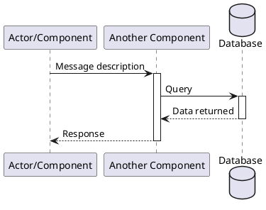
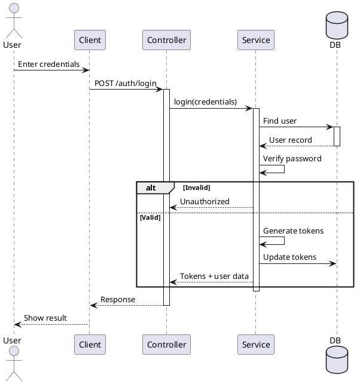
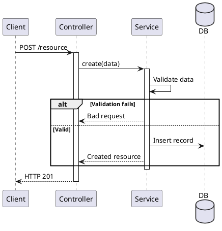
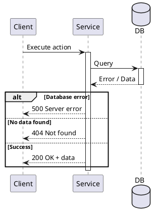
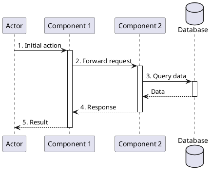

# Sequence Diagram Guidelines

This document provides instructions for creating and maintaining sequence diagrams in PlantUML format for the Capstone Project.

## Overview

Sequence diagrams show process interactions arranged in time sequence, depicting:
- Participants/actors involved
- Messages exchanged between them
- Order of interactions
- Decision points and alternatives

## PlantUML Syntax Reference

### Basic Structure



### Key Elements

#### Participants
- **Actor**: `actor "Name" as alias`
- **Participant/Component**: `participant "Name" as alias`
- **Database**: `database "Name" as alias`
- **Boundary/System**: `boundary "Name" as alias`
- **Control/Process**: `control "Name" as alias`

#### Message Types

| Arrow Type | Syntax | Meaning |
|-----------|--------|---------|
| Synchronous call | `->` | Method call (caller waits) |
| Asynchronous | `-->` | Return message or async call |
| Create | `->` | Instantiate new object |
| Delete | `->` | Destroy object |
| Self-call | `->` | Message to self |

#### Activation Boxes
```plantuml
activate component      % Start execution
deactivate component    % End execution
```

### Conditional Logic

#### Alt (Alternative - if/else)
```plantuml
alt Condition 1
  message1 -> message2
else Condition 2
  message3 -> message4
end
```

#### Opt (Optional)
```plantuml
opt [Condition]
  message1 -> message2
end
```

#### Loop
```plantuml
loop [Repeat condition]
  message1 -> message2
end
```

#### Par (Parallel)
```plantuml
par [Parallel process 1]
  message1 -> message2
and [Parallel process 2]
  message3 -> message4
end
```

## Best Practices

### 1. **Naming Conventions**
- Use clear, descriptive names for participants
- Use lowercase aliases for shorter references
- Use multi-line names sparingly (only for long names)
  ```plantuml
  participant "Auth\nController" as controller
  ```

### 2. **Message Numbering**
- Number messages sequentially (1, 2, 3, etc.) for clarity
- Use format: `1. Action description`
- Helps readers follow the exact flow

### 3. **Message Details**
- Include parameter names and field names explicitly
- Don't use DTO class names, write out the actual fields
- Format: `{field1, field2, field3}` for objects
- Use `\n` for line breaks when message is long
- Example: `POST /auth/register\n{fullName, email, phoneNumber}`

### 4. **Activation Management**
- Use `activate` before a participant handles work
- Use `deactivate` when done
- Shows execution timeframe visually

### 5. **Error Handling**
- Use `alt` blocks for success/failure paths
- Keep error paths concise
- Show what the system does in each case

### 6. **Return Values**
- Use dashed arrows (`-->`) for returns
- For success: write simple message like "Success", "Data created", "Register success"
- For objects: show actual field names, not just DTO names
- Example: `{accessToken, refreshToken, user}` instead of `LoginResponseDto`

### 7. **Readability**
- Limit to 5-7 participants per diagram
- Keep message count under 20 steps
- Use meaningful message descriptions
- Add line breaks in long messages with `\n`

## Common Patterns

### Login/Authentication Flow


### CRUD Operation


### Error Handling


## File Organization

```
diagrams/
├── sequence/
│   ├── login.puml                          # Authentication flow
│   ├── register.puml                       # User registration
│   ├── course-enrollment.puml              # Course enrollment flow
│   ├── payment.puml                        # Payment processing
│   └── SEQUENCE_DIAGRAM_INSTRUCTIONS.md    # This file
├── state-machine/
│   └── [state diagrams]
└── package/
    └── [package diagrams]
```

## Creating New Diagrams

### Steps:
1. **Identify the flow**: What's the main process?
2. **List participants**: Who/what is involved?
3. **Map interactions**: What messages are sent?
4. **Add conditions**: Where are decision points?
5. **Number steps**: Label for clarity
6. **Test rendering**: Ensure PlantUML parses correctly

### Template:


## Diagram Naming Convention

- **Format**: `<process-name>.puml`
- **Examples**:
  - `login.puml`
  - `user-registration.puml`
  - `payment-processing.puml`
  - `course-enrollment.puml`

## Maintenance

- Update diagrams when process flows change
- Keep diagrams in sync with actual implementation
- Review during code reviews
- Document complex flows thoroughly

## Tools & Rendering

- **Format**: PlantUML
- **View online**: https://www.plantuml.com/plantuml/uml/
- **IDE Support**: Most IDEs have PlantUML extensions
- **Export**: PlantUML can export to PNG, SVG, PDF

## References

- [PlantUML Sequence Diagram Documentation](https://plantuml.com/sequence-diagram)
- [UML Sequence Diagrams](https://en.wikipedia.org/wiki/Sequence_diagram)
- [UML 2.5.1 Specification](https://www.omg.org/spec/UML/2.5.1/PDF)
