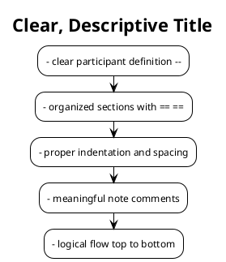

# Sequence Diagram Instructions

## Purpose
Sequence diagrams visualize the interactions between different components of the system over time, showing message flow and processing order.

## Structure & Components

### 1. **Participants (Lifelines)**
Represents the actors/components involved in the sequence:

```plantuml
actor User
participant "Client App" as Client
participant "Backend" as Backend
participant "Service Layer" as Service
participant "Database" as DB
```

**Naming Convention:**
- `actor` = End users (Guest, Coach, Admin, Learner)
- `participant` = System components (Client App, Backend, Services, Database)
- **Always use "Backend" to represent the backend system**

### 2. **Activation Boxes**
Show when a component is actively processing:

```plantuml
activate Backend
  -- processing logic --
deactivate Backend
```

**Rules:**
- `activate` = Component starts processing
- `deactivate` = Component finishes processing
- Can be nested when one component calls another

### 3. **Messages (Arrows)**
Show communication between participants:

```plantuml
User -> Client: User Action
Client -> Backend: HTTP Request\n(method, path, body)
Backend -> Service: Function Call
Service -> DB: Query/Update
DB --> Service: Return Result
Service --> Backend: Return Response
Backend --> Client: HTTP Response
Client --> User: Display Result
```

**Arrow Types:**
- `->` = Synchronous call (waiting for response)
- `-->` = Return value
- `=>` = Asynchronous call (fire and forget)

### 4. **Alt (Alternative/If-Else Logic)**

```plantuml
alt Condition 1
  -- sequence if true --
else Condition 2
  -- sequence if false --
end
```

**Usage:** Decision points in flow (validation success/failure, approval/rejection)

### 5. **Loop (Repeated Actions)**

```plantuml
loop For Each Item
  -- repeated sequence --
end
```

**Usage:** Processing multiple items, retries

### 6. **Notes & Comments**

```plantuml
note over Component: Single line note

note over Comp1, Comp2: Multi-component note\nwith multiple lines\nof explanation
```

**Usage:** Clarify business logic, explain constraints

## Sequence Diagram Examples in This Project

### Example 1: Guest Registration (guest-as-learner.puml)
- **Flow:** Guest → Client → API Gateway (Backend) → Auth Service → Database
- **Key Points:**
  - Phone number validation
  - Decision point (phone exists vs. available)
  - User + Learner profile creation
  - SMS verification token generation

### Example 2: Coach Registration (coach-registration.puml)
- **Flow:** Coach → Client → API Gateway (Backend) → Auth Service → Coach Service → Database
- **Key Points:**
  - Similar to learner but with additional coach profile fields
  - Status starts as UNVERIFIED
  - Requires admin approval before full access

### Example 3: Admin Verify Coach (admin-verify-coach.puml)
- **Flow:** Admin → Portal → API Gateway (Backend) → Coach Service → Database + Notification Service
- **Key Points:**
  - Transaction handling
  - Conditional approval/rejection logic
  - User activation on verification
  - Notification sending

## Naming Conventions

### Participants
```
actor User/Guest/Coach/Admin/Learner
participant "Client App" as Client
participant "Backend" as Backend
participant "Auth Service" as Auth
participant "Service Name" as ServiceVar
participant "Database" as DB
participant "External Service" as External
```

### HTTP Requests
```plantuml
Client -> API: POST /endpoint\n(param1, param2, param3)
Client -> API: GET /resource/:id\nwith JWT token
Client -> API: PUT /resource/:id\n(updatedData)
Client -> API: DELETE /resource/:id
```

### Response Messages
```plantuml
API --> Client: Success Response (200 OK)\n{data}
API --> Client: Error Response (4xx/5xx)\n{error message}
API --> Client: Return Token / Created Entity
```

### Service Interactions
```plantuml
API -> Service: functionName(parameters)
API -> DB: Query/Insert/Update/Delete\n(SQL operation)
DB --> API: Return Result / Updated Record
```

## Best Practices

### 1. **Clear Start & End**
- Begin with clear user action (click button, form submission)
- End with visible feedback to user (success message, redirect, error display)

### 2. **Meaningful Labels**
```plantuml
-- GOOD --
Client -> Backend: POST /auth/register\n(fullName, phoneNumber, password)

-- BAD --
Client -> Backend: Send Data
```

### 3. **Group Related Operations**
Use sections (`==`) to organize flow:
```plantuml
== Registration Start ==
== Validate & Check Phone ==
== Create User Account ==
== Success Response ==
== Registration End ==
```

### 4. **Keep Responses Simple**
- **Do NOT include detailed data in success responses**
- Use simple acknowledgments like "Success" or "Updated"
- Only include error details for failure cases

```plantuml
-- GOOD (Simple) --
Backend --> Client: Success (200 OK)

-- BAD (Over-detailed) --
Backend --> Client: Success Response (200 OK)\n{id, key, value, dataType, description,\nupdate_by: admin_id, updatedAt}
```

### 5. **Avoid Redundant UI Operations**
- **Do NOT show clearing forms or updating table rows** - these are implementation details
- **Do NOT show logout sequences** - they are out of scope for feature diagrams
- Client-side UI updates are assumed after successful responses
- Focus on system-to-system interactions only

```plantuml
-- GOOD (Focused) --
Backend --> Client: Success (200 OK)
Client --> Admin: Show Success Message\n"Configuration updated successfully"

-- BAD (Over-detailed) --
Client -> Client: Update Table Row\nwith New Value
Client -> Client: Clear Edit Form
Admin -> Client: Click "Logout" Button
Client -> Backend: POST /auth/logout
```

### 6. **Process End, Not Logout**
- End diagrams with a clear process completion note
- Do NOT include logout as part of the sequence
- Logout is a separate concern from feature workflows

```plantuml
== Process End ==
note over User: [Feature] process complete.\nNext steps or expectations.

-- NOT --
== Admin Logout ==
Admin -> Client: Click "Logout" Button
Client -> Backend: POST /auth/logout
```

### 6. **Simplify Login Flows**
- Do NOT show password comparison, hashing, or JWT generation details
- Do NOT show nested role/permission validation checks
- Authentication is implementation detail - keep it simple
- Show only: credentials validation → success/error → token/redirect

```plantuml
-- GOOD (Simplified Login) --
Client -> Backend: POST /auth/login\n(email, password)
Backend -> Auth: login(email, password)
Auth -> DB: Verify Credentials
alt Invalid
  Auth --> Backend: Error
  Backend --> Client: Error Response (401)
else Valid
  Auth --> Backend: Login Success\n(accessToken)
  Backend --> Client: Success
end

-- BAD (Over-detailed) --
Auth -> Auth: Compare Password Hash\nverify(inputPassword, storedHash)
alt Password Invalid
  -- nested validations --
else Password Valid
  alt User Not ADMIN Role
    -- more nesting --
  else User is ADMIN
    Auth -> Auth: Generate JWT Token\n(user_id, role, permissions)
    -- too many details --
  end
end
```

### 7. **Include Decision Logic**
Always show what happens for both success and failure:
```plantuml
alt Phone Already Exists
  -- error path --
else Phone is Available
  -- success path --
end
```

### 7. **Transaction Management**
Highlight transaction boundaries:
```plantuml
CoachService -> DB: Begin Transaction
DB --> CoachService: Transaction Started
  -- multiple operations --
DB --> CoachService: Transaction Committed / Rollback
```

### 8. **Activation Hierarchy**
Properly nest activations to show call stack:
```plantuml
Client -> Backend: Request
activate Backend
  Backend -> Service: Call Service
  activate Service
    Service -> DB: Query
    activate DB
    DB --> Service: Result
    deactivate DB
  Service --> Backend: Return
  deactivate Service
Backend --> Client: Response
deactivate Backend
```

## File Naming Convention
```
/diagrams/sequence/
├── guest-as-learner.puml           (Learner registration flow)
├── coach-registration.puml         (Coach registration flow)
├── admin-verify-coach.puml         (Admin approval flow)
├── enrollment-and-payment.puml     (Enrollment process)
├── video-upload-and-analysis.puml  (Video processing)
└── [feature-name].puml
```

## Common Sequence Patterns

### Pattern 1: Registration/Authentication
1. User action (click, form submit)
2. Client validation
3. API request
4. Validation check (exists? valid? etc.)
5. Create entity (on success)
6. Success/error response
7. User feedback

### Pattern 2: Data Retrieval
1. User request (click, page load)
2. API query with filters/pagination
3. Database query
4. Return filtered results
5. Display to user

### Pattern 3: Update/Delete
1. User action (submit form, click delete)
2. Confirmation/validation
3. API request with ID/data
4. Database update/delete
5. Response with updated entity
6. User feedback

### Pattern 4: Admin Action (Approval)
1. Admin views pending items
2. Admin reviews details
3. Admin makes decision
4. Conditional logic (approve/reject)
5. Update status in database
6. Send notification
7. Confirmation to admin

## Rendering Tips

### For Better Readability


### Common Issues & Solutions

| Issue | Solution |
|-------|----------|
| Overlapping lines | Use `skinparam ranksep` and `nodesep` |
| Unclear flow | Add section headers (`== Section ==`) |
| Too long | Split into multiple diagrams |
| Missing context | Add `note` elements to explain |
| Confusing actors | Use descriptive participant names |

## Backend Representation

**Always display Backend as the primary system component:**

```plantuml
-- CORRECT --
Client -> Backend: HTTP Request
Backend -> Service: Internal Call
Backend --> Client: HTTP Response

-- INCORRECT --
Client -> Service: Direct Call
Client -> DB: Direct Query
```

The Backend acts as:
- HTTP endpoint handler
- Request router
- Service coordinator
- Response formatter
- Security/Auth enforcer

All backend operations flow through Backend.

## When to Create New Sequence Diagrams

1. **Major User Journeys** - Registration, enrollment, payment
2. **Complex Workflows** - Multi-step processes with conditions
3. **System Interactions** - How services communicate
4. **Admin Operations** - Approval, verification, management flows
5. **Error Handling** - Exception paths and recovery

## When to Skip Sequence Diagrams

- Simple CRUD operations (show in API documentation instead)
- Single-actor operations (show in state diagrams)
- Very short flows (use class/component diagrams)

---

## Service Implementation Best Practices

### Overview
Services in the API Gateway follow consistent patterns based on the repository, database entities, and shared helpers. These patterns ensure consistency between sequence diagrams and actual implementation.

### 1. **Service Structure**

```typescript
@Injectable({ scope: Scope.REQUEST })
export class YourService extends BaseTypeOrmService<Entity> {
  constructor(
    @Inject(REQUEST) private readonly request: CustomApiRequest,
    @InjectRepository(Entity)
    private readonly entityRepository: Repository<Entity>,
    @InjectRepository(RelatedEntity)
    private readonly relatedRepository: Repository<RelatedEntity>,
    private readonly datasource: DataSource,
  ) {
    super(entityRepository);
  }
}
```

**Key Points:**
- Scope: `REQUEST` - Fresh instance per HTTP request
- Extend `BaseTypeOrmService<Entity>` - Provides base CRUD methods
- Inject `CustomApiRequest` - Access to logged-in user info
- Inject `DataSource` - For transaction management
- Follow DI pattern for related services

### 2. **Common Method Patterns**

#### Find Operations
```typescript
async findAll(findOptions: FindOptions): Promise<PaginateObject<Entity>> {
  return super.find(findOptions, 'entity', PaginateObject<Entity>);
}

async findOne(id: number): Promise<Entity> {
  return await this.entityRepository.findOne({
    where: { id: id },
    withDeleted: false,
    relations: ['relation1', 'relation2'],
  });
}

async findByUserId(): Promise<Entity> {
  return await this.entityRepository.findOne({
    where: { user: { id: this.request.user.id as User['id'] } },
    withDeleted: false,
    relations: ['relation1'],
  });
}
```

#### Create Operations with Transactions
```typescript
async create(data: CreateDto): Promise<CustomApiResponse<void>> {
  return await this.datasource.transaction(async (manager) => {
    const related = await manager.getRepository(Related).findOne({
      where: { id: data.relatedId },
    });
    
    const newEntity = manager.getRepository(Entity).create({
      user: { id: this.request.user.id as User['id'] },
      related: related,
      ...data,
    });
    
    await manager.getRepository(Entity).save(newEntity);

    return new CustomApiResponse<void>(
      HttpStatus.CREATED,
      'Entity created successfully',
    );
  });
}
```

#### Update Operations
```typescript
async update(
  id: number,
  data: UpdateDto,
): Promise<CustomApiResponse<void>> {
  return await this.datasource.transaction(async (manager) => {
    const entity = await manager.getRepository(Entity).findOne({
      where: { id: id },
      withDeleted: false,
    });
    
    if (!entity) throw new InternalServerErrorException('Entity not found');
    
    await manager.getRepository(Entity).update(entity.id, data);

    return new CustomApiResponse<void>(
      HttpStatus.OK,
      'Entity updated successfully',
    );
  });
}
```

### 3. **Business Logic Operations**

```typescript
async handleSpecialAction(amount: number): Promise<CustomApiResponse<void>> {
  return await this.datasource.transaction(async (manager) => {
    // 1. Fetch related data
    const entity = await manager.getRepository(Entity).findOne({
      where: { user: { id: this.request.user.id as User['id'] } },
      withDeleted: false,
    });
    
    if (!entity) throw new InternalServerErrorException('Entity not found');

    // 2. Validate business logic
    const currentValue = Number(entity.value ?? 0);
    if (amount > currentValue) {
      throw new InternalServerErrorException('Insufficient value');
    }

    // 3. Update primary entity
    const newValue = currentValue - amount;
    entity.value = newValue;
    await manager.getRepository(Entity).save(entity);

    // 4. Create audit/transaction records
    const transaction = manager.getRepository(Transaction).create({
      entity: entity,
      type: TransactionType.DEBIT,
      amount: amount,
    });
    await manager.getRepository(Transaction).save(transaction);

    return new CustomApiResponse<void>(HttpStatus.OK, 'Action successful');
  });
}
```

**Example: WalletService.handleWithdrawalRequest()**
```typescript
async handleWithdrawalRequest(amount: number): Promise<CustomApiResponse<void>> {
  return await this.datasource.transaction(async (manager) => {
    // 1. Get wallet with balance check
    const wallet = await manager.getRepository(Wallet).findOne({
      where: { user: { id: this.request.user.id as User['id'] } },
      withDeleted: false,
    });
    if (!wallet) throw new InternalServerErrorException('Wallet not found');

    // 2. Validate business rule
    const currentBalance = Number(wallet.currentBalance ?? 0);
    if (amount > currentBalance)
      throw new InternalServerErrorException('Insufficient balance');

    // 3. Deduct from wallet
    const newCurrent = currentBalance - amount;
    wallet.currentBalance = newCurrent;
    await manager.getRepository(Wallet).save(wallet);

    // 4. Create transaction record
    const newTransaction = manager.getRepository(WalletTransaction).create({
      wallet: wallet,
      type: WalletTransactionType.DEBIT,
      amount: amount,
    });
    await manager.getRepository(WalletTransaction).save(newTransaction);

    return new CustomApiResponse<void>(HttpStatus.OK, 'Withdrawal successful');
  });
}
```

### 4. **Response Patterns**

**Use CustomApiResponse for consistency:**
```typescript
// Success responses
return new CustomApiResponse<void>(HttpStatus.CREATED, 'Entity created');
return new CustomApiResponse<void>(HttpStatus.OK, 'Updated successfully');

// Error throwing (handled by ExceptionFilter)
throw new InternalServerErrorException('Specific error message');
throw new BadRequestException('Invalid data');
```

### 5. **Database Transaction Best Practices**

```typescript
// Always use transactions for multi-step operations
return await this.datasource.transaction(async (manager) => {
  // Step 1: Validate/fetch
  const entity = await manager.getRepository(Entity).findOne({ ... });
  
  // Step 2: Business logic validation
  if (!isValid) throw new Error('Validation failed');
  
  // Step 3: Update primary records
  await manager.getRepository(Entity).save(updatedEntity);
  
  // Step 4: Create audit/related records
  await manager.getRepository(AuditLog).save(auditEntry);
  
  // All changes committed together or all rolled back on error
  return new CustomApiResponse<void>(HttpStatus.OK, 'Success');
});
```

### 6. **Sequence Diagram to Service Mapping**

| Sequence Diagram Element | Service Implementation |
|--------------------------|------------------------|
| Service calls method | `service.methodName(params)` |
| Validate condition | `if (!condition) throw Exception` |
| Database query | `manager.getRepository(Entity).findOne()` |
| Database insert | `manager.getRepository(Entity).create()` + `.save()` |
| Database update | `manager.getRepository(Entity).update()` |
| Create transaction | `manager.getRepository(Transaction).create()` + `.save()` |
| Return success | `new CustomApiResponse<void>(HttpStatus.OK, message)` |
| Return error | `throw new Exception(message)` |

### 7. **Common Service Integration Patterns**

**Injecting another service:**
```typescript
constructor(
  // ...
  private readonly walletService: WalletService,
  private readonly notificationService: NotificationService,
) {}

// Using injected services
async handleEnrollment(userId: number, amount: number) {
  // Call wallet service
  await this.walletService.handleWalletTopUp(userId, amount);
  
  // Call notification service
  await this.notificationService.sendNotification(...);
}
```

**Important:** In sequence diagrams, show the Backend coordinating these calls, not direct service-to-service communication.

---

````**Last Updated:** November 26, 2025
**Project:** Pickleball Learning Platform
**Diagram Tool:** PlantUML
